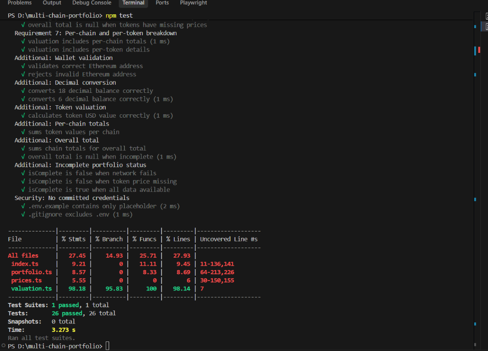
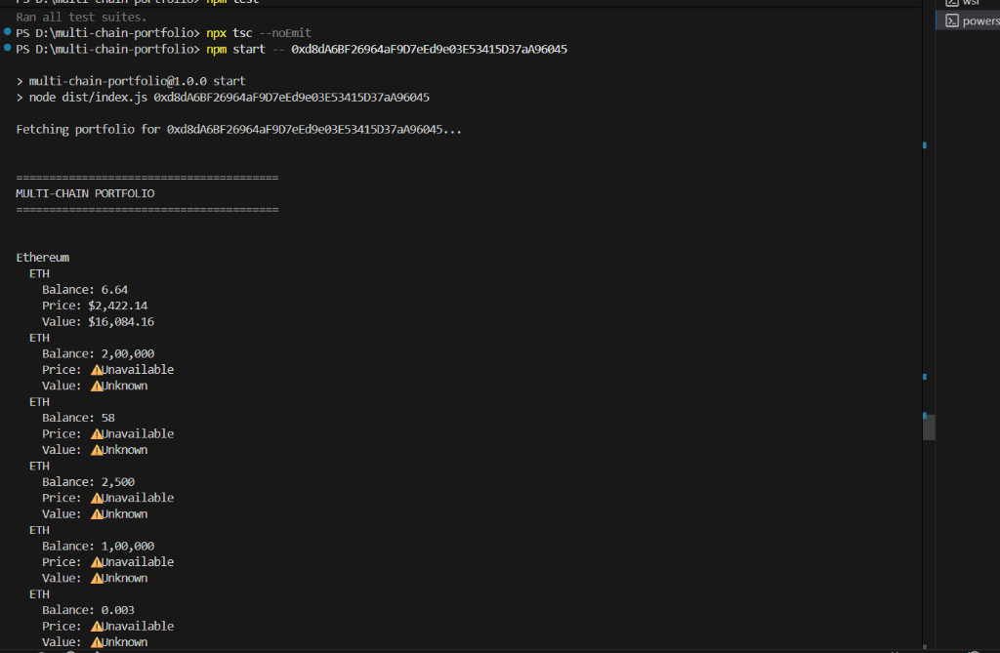

# Multi-Chain Portfolio Valuation

A CLI application that fetches token holdings across multiple EVM networks using Alchemy's Portfolio API (`POST /data/v1/{apiKey}/assets/tokens/balances/by-address`), retrieves current prices via Alchemy's Prices API (`POST /prices/v1/{apiKey}/tokens/by-address`), and calculates a USD valuation with proper handling of partial failures and missing prices.

## Problem

"The Multi-Chain Bag Nobody Can Total Up" - A wallet holds tokens across multiple chains (Ethereum, Base, Optimism, Polygon, BNB Chain). We need to:

1. Fetch all holdings in a single multi-network fan-out request
2. Get accurate prices for each token using network + contract address matching
3. Calculate per-chain and overall totals
4. Visibly handle partial failures (failed networks, missing prices)
5. Never silently treat missing prices as $0

## Architecture

```
┌─────────────────┐
│   CLI Entry     │  (index.ts)
│  - Parse args   │
│  - Load .env    │
└────────┬────────┘
         │
         ▼
┌─────────────────┐
│ Portfolio API   │  (portfolio.ts)
│ - Fan-out req   │  POST /data/v1/.../assets/tokens/balances/by-address
│ - 5 networks    │
│ - Error check   │
└────────┬────────┘
         │
         ▼
┌─────────────────┐
│  Prices API     │  (prices.ts)
│ - Network+addr  │  POST /prices/v1/.../tokens/by-address (batching)
│ - Per-token     │
│ - Error track   │
└────────┬────────┘
         │
         ▼
┌─────────────────┐
│  Valuation      │  (valuation.ts)
│ - Decimals      │
│ - Chain totals  │
│ - Overall total │
│ - Missing price │
└─────────────────┘
```

## API Flow

### 1. Multi-Network Fan-Out (Portfolio API)

Uses `POST https://api.g.alchemy.com/data/v1/{apiKey}/assets/tokens/balances/by-address` with an explicit network array:

```typescript
const NETWORKS = [
  "eth-mainnet",
  "base-mainnet",
  "opt-mainnet",
  "polygon-mainnet",
  "bnb-mainnet",
];

const response = await fetch(url, {
  method: "POST",
  headers: { "Content-Type": "application/json" },
  body: JSON.stringify({
    addresses: [{ address, networks: NETWORKS }],
    includeNativeTokens: true,
    includeErc20Tokens: true,
  }),
});
```

This makes **ONE** request that fans out to all 5 networks. Not 5 separate requests.

### 2. Top-Level Error Check

Every Portfolio API response is checked for `error` field, regardless of HTTP status:

```typescript
if (response.error) {
  // Handle top-level error
  if (response.error.partialErrors) {
    // Preserve successful data, mark incomplete
  }
}
```

### 3. Partial Error Handling

If `partialErrors` exists in the error response:
- Successful network data is preserved
- Failed networks are marked with their specific error
- Final output shows `⚠️ PORTFOLIO DATA INCOMPLETE`
- Failed networks listed explicitly

### 4. Price Matching (Prices API)

Prices fetched using `POST https://api.g.alchemy.com/prices/v1/{apiKey}/tokens/by-address` for **each unique token** (deduplicated by network + contract address, batched in 20-token chunks to comply with API limits).

**Critical**: Matching uses **both** network AND contract address. USDC on Ethereum (`0xA0b86...`) and USDC on Base (`0x83358...`) are treated as completely different tokens.

### 5. Token-Level Pricing Errors

Individual token price failures are tracked separately from network failures:

```
❌ Network data unavailable
Network: Polygon

⚠️ Token price unavailable
Network: Base
Token: ABC
Contract: 0x...
```

### 6. Valuation Logic

- Converts raw balances using token decimals: `balance / 10^decimals` (supporting both decimal strings and `0x` hex strings)
- Calculates token value: `formattedBalance * price`
- Per-chain total: Sum of valued tokens (excluding missing prices)
- Overall total: Sum of chain totals (null if any chain/token incomplete)
- Missing prices: Token excluded from numeric total, warning emitted

### 7. Missing Price Handling

**Never** does `price ?? 0`. Instead:

```typescript
if (price === null) {
  hasMissingPrices = true;
  missingPriceTokens.push(token.symbol);
  warnings.push(`⚠️ Price unavailable for ${symbol} on ${network}. Excluded from total.`);
}
```

## Setup

```bash
# Install dependencies
npm install

# Copy environment template
cp .env.example .env

# Edit .env with your Alchemy API key
# ALCHEMY_API_KEY=your_actual_key_here
```

## Usage

```bash
# Build
npm run build

# Run
npm start -- 0xd8dA6BF26964aF9D7eEd9e03E53415D37aA96045

# Or with ts-node
npx ts-node src/index.ts 0xd8dA6BF26964aF9D7eEd9e03E53415D37aA96045
```

## ✅ Verification

### Automated Tests

The project passes all challenge-specific and supporting tests.

- 26/26 tests passing
- 0 failed
- TypeScript compilation passes with no errors



### Live Multi-Chain Portfolio

The application was verified against the challenge test wallet and successfully fetched live portfolio data across:

- Ethereum Mainnet
- Base
- Optimism
- Polygon
- BNB Chain

The output provides per-chain and per-token balances, prices, values, and clearly identifies tokens whose prices are unavailable.

When required pricing data is missing, the application does **not** report a misleading partial total. Instead, it displays:

`TOTAL: Unknown`

and marks the portfolio as incomplete.



## Testing

```bash
# Run tests with coverage
npm test

# Type check
npx tsc --noEmit
```

Tests cover all 7 challenge requirements:
1. Multi-network fan-out request structure
2. Top-level error detection
3. PartialErrors visibly change output
4. Price matching uses network + contract address
5. Token pricing error ≠ network failure
6. Missing price ≠ zero
7. Per-chain/per-token breakdown

Plus: wallet validation, decimal conversion, token valuation, chain totals, overall total, incomplete status, and security (no committed credentials).

## Security

- API key stored in `.env` (gitignored)
- `.env.example` contains only placeholder
- No private keys or signing
- Read-only API requests
- `.gitignore` excludes `.env`, `node_modules`, `dist`, `coverage`

## Project Structure

```
multi-chain-portfolio/
│
├── screenshots/
│   ├── tests-pass.png
│   └── live-portfolio.png
│
├── src/
│   ├── portfolio.ts    # Portfolio API client, fan-out, errors
│   ├── prices.ts       # Prices API client, network+addr matching
│   ├── valuation.ts    # Decimal conversion, totals, missing prices
│   ├── index.ts        # CLI entry, orchestration, output
│   └── tests.test.ts   # Unit tests (mocked, no live API)
├── data/
│   └── .gitkeep
├── .env.example
├── .gitignore
├── package.json
├── package-lock.json
├── tsconfig.json
└── README.md
```

## Networks in Fan-Out Request

1. Ethereum Mainnet (`eth-mainnet`)
2. Base Mainnet (`base-mainnet`)
3. Optimism Mainnet (`opt-mainnet`)
4. Polygon Mainnet (`polygon-mainnet`)
5. BNB Chain Mainnet (`bnb-mainnet`)

## APIs Used

- **Alchemy Portfolio API**: `POST https://api.g.alchemy.com/data/v1/{apiKey}/assets/tokens/balances/by-address` - Single multi-network request
- **Alchemy Prices API**: `POST https://api.g.alchemy.com/prices/v1/{apiKey}/tokens/by-address` - Per-token pricing (batched in 20-token chunks)

## Dependencies

- `dotenv`: Environment variable loading
- `typescript`, `ts-node`, `jest`, `ts-jest`: Development tooling